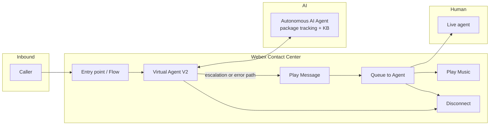

# Architecture — Autonomous AI Agent (Package Tracking)

High-level flow for the vendored Flow Designer sample: inbound voice enters WxCC, the flow invokes the autonomous AI agent via VAV2, then either completes in the AI path or escalates to a human agent queue.

