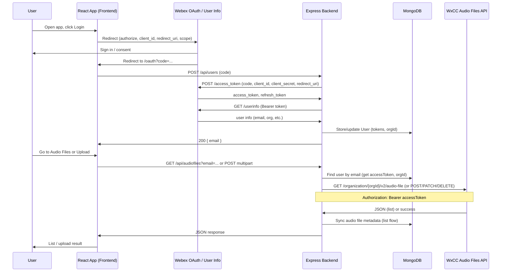

# Architecture Diagram — Audio Files Integration

- **Trigger:** User opens the app and signs in with Webex (OAuth 2.0 authorization code).
- **Authentication:** Backend exchanges the code for tokens at `webexapis.com`, stores them in MongoDB, and uses the access token for all WxCC API calls.
- **API calls:** Backend calls the Webex Contact Center Audio Files API (list, create, update, delete) using the organization ID and Bearer token from the stored user.
