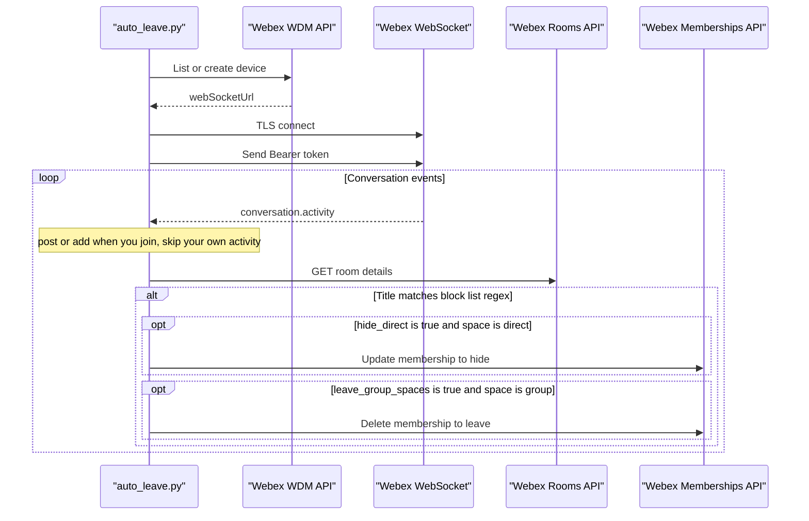

# Architecture

Real-time **conversation.activity** events can drive **Rooms** lookups and **Memberships** changes after a title matches the block list and **`hide_direct`** or **`leave_group_spaces`** is enabled in YAML.

OAuth tokens are obtained via the **wxc-sdk** integration helper (browser flow when not in Docker, or printed auth URL in Docker). Tokens refresh on a timer and the WebSocket is re-authorized after refresh.

If both YAML flags are **`false`**, a matching title only produces logs (no **Memberships** calls). The **`opt`** blocks in the diagram are the only branches where the app mutates membership.
