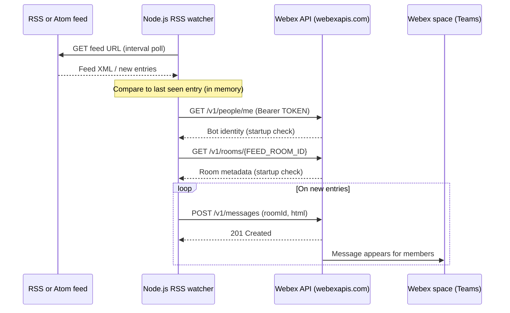

# Architecture — RSS to Webex space

This diagram shows how the sample polls a syndicated feed and posts new items into **Webex Teams** using a **bot token** and the **Webex REST API**.

Authentication uses a **static bot access token** (`TOKEN`) on each HTTPS request to `webexapis.com`. The RSS source is typically unauthenticated public HTTP(S); private feeds may need headers or allowlisting (not shown in the boilerplate).
