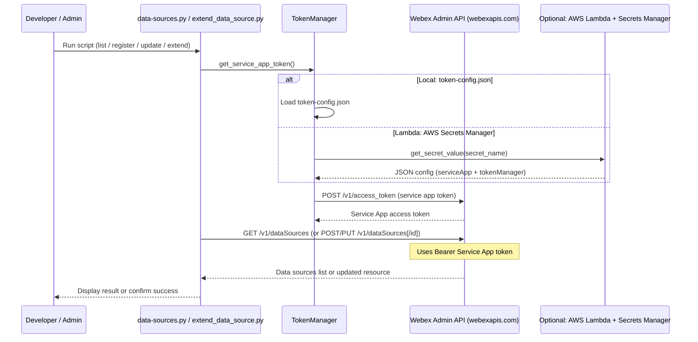

# BYODS Manager — Architecture

The diagram below shows how the BYODS Manager integrates with the Webex Admin API for local and optional Lambda-based token extension.

- **Trigger:** User runs the script (or EventBridge triggers Lambda on a schedule).
- **Authentication:** TokenManager loads credentials from local `token-config.json` or AWS Secrets Manager, then obtains a Service App access token from Webex.
- **API calls:** Script uses that token to call Webex Data Source APIs (list, register, update, extend).
- **Response:** Results are shown in the CLI (or returned in Lambda response).
