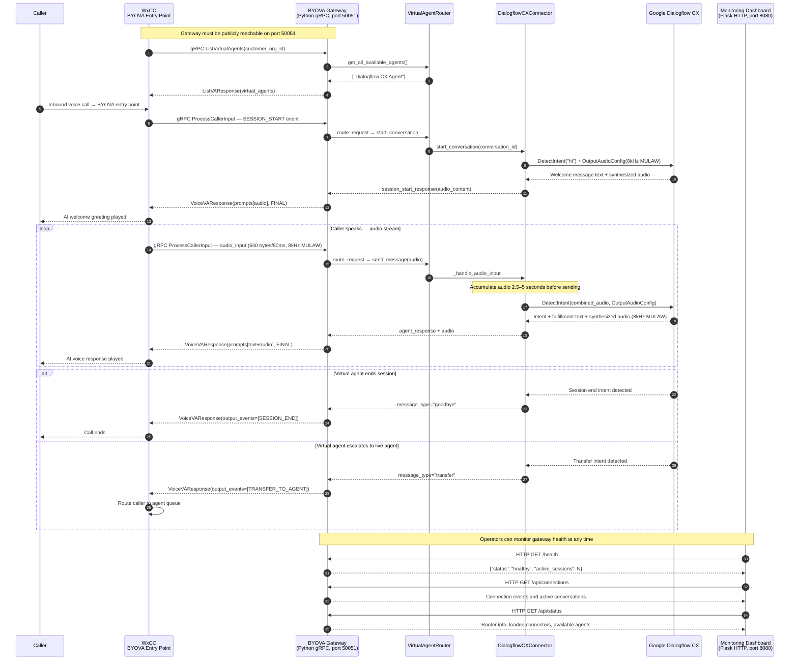
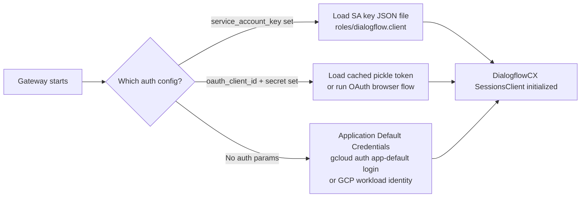

# Architecture Diagram — BYOVA Dialogflow CX Gateway

This diagram shows the full call flow from an inbound caller through Webex Contact Center, the BYOVA gRPC gateway, and Google Dialogflow CX.

## Component Descriptions

| Component | Technology | Port | Purpose |
|-----------|-----------|------|---------|
| **WxCC BYOVA Entry Point** | Webex Contact Center | — | Receives inbound calls; routes to BYOVA-configured virtual agent |
| **BYOVA Gateway** | Python 3.8+, gRPC (grpcio) | 50051 | Implements `VoiceVirtualAgent` gRPC service; bridges WxCC ↔ AI backend |
| **VirtualAgentRouter** | Python | — | Loads connector plugins from `config.yaml`; routes calls by agent ID |
| **DialogflowCXConnector** | Google Cloud Dialogflow CX SDK | — | Converts WxCC audio to Dialogflow API calls; handles auth (ADC / OAuth / SA key) |
| **Google Dialogflow CX** | Google Cloud | HTTPS | Natural language understanding; intent detection; SSML/audio response synthesis |
| **Monitoring Dashboard** | Flask (Python) | 8080 | HTTP endpoints + browser UI for session tracking and health checks |

## Audio Format Details

WxCC sends caller audio in **8kHz G.711 μ-law (MULAW)** format at ~640 bytes per 80ms chunk. The connector:

1. **Accumulates** chunks for 2.5–5 seconds (configurable via `min_audio_seconds` / `max_audio_seconds`)
2. **Detects format** automatically based on chunk size (640-byte chunks = WxCC; larger = test files)
3. **Converts** if the target connector requires a different format (e.g., 16kHz LINEAR_16)
4. **Sends** to Dialogflow CX `DetectIntent` with the configured `InputAudioConfig`
5. **Receives** synthesized speech from Dialogflow in 8kHz MULAW (compatible with WxCC telephony)

## Authentication Flow (Dialogflow CX)

