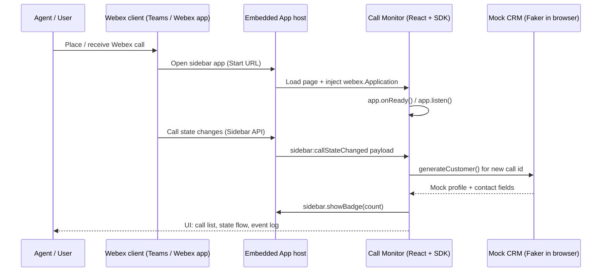

# Architecture — Call Monitor Embedded App

This playbook ships a React app that runs inside the **Webex Embedded App Sidebar** during **Webex Calling** sessions. The host Webex client loads your HTTPS (or local dev) URL, injects the [Embedded App SDK](https://developer.webex.com/docs/embedded-apps-framework-sidebar-api-quick-start), and delivers call lifecycle events to your code. Customer records in the sample are **generated locally** (Faker); a production app would swap this for REST lookups to CRM or line-of-business systems.

Authentication for the **sample** is implicit: the user is already signed into Webex, and the SDK runs in the embedded context. Any **real** CRM integration you add should use your own OAuth / API keys via environment variables and server-side or secured patterns—not hardcoded secrets in the bundle.
