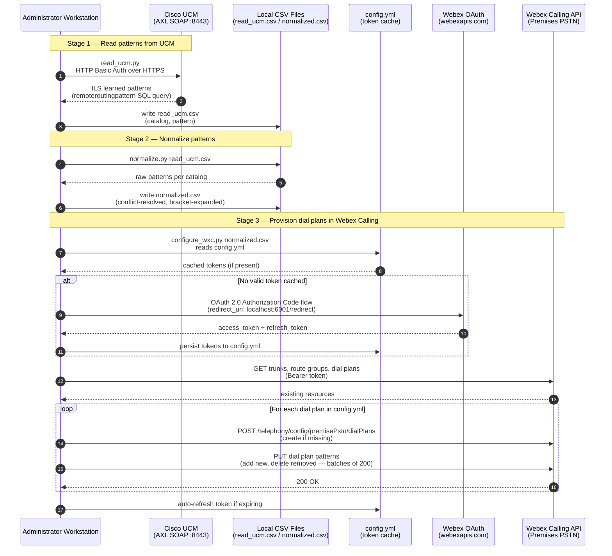

# Architecture Diagram — Cisco UCM Dial Plan + Webex Calling Integration

The integration operates as a three-stage offline pipeline executed from an administrator workstation. No inbound webhooks or persistent services are required.

## Component Descriptions

| Component | Role |
|---|---|
| Administrator Workstation | Runs the Python CLI scripts; requires network access to UCM (:8443) and Webex APIs |
| Cisco UCM (AXL SOAP) | Source of ILS-learned dial patterns; queried via the Thin AXL SOAP API using SQL queries |
| Local CSV Files | Intermediate data store; `read_ucm.csv` (raw) and `normalized.csv` (processed) |
| config.yml | Stores OAuth token cache and dial plan mapping configuration |
| Webex OAuth | Issues and refreshes access tokens for the Webex Calling API via Authorization Code flow |
| Webex Calling API (Premises PSTN) | Creates and manages dial plans, trunk/route group assignments, and dial patterns |

## Security Notes

- UCM access uses HTTP Basic Auth over HTTPS. TLS certificate validation is **disabled by default** in the upstream code — enable it for production use (see Known Limitations in README.md).
- Webex API access uses short-lived OAuth 2.0 access tokens. Tokens are cached in `config.yml` (not in environment variables) and auto-refreshed using the stored refresh token.
- UCM credentials (`AXL_USER`, `AXL_PASSWORD`) and Webex integration credentials (`TOKEN_INTEGRATION_CLIENT_ID`, `TOKEN_INTEGRATION_CLIENT_SECRET`) are loaded exclusively from environment variables via `python-dotenv`. They must never be committed to source control.
