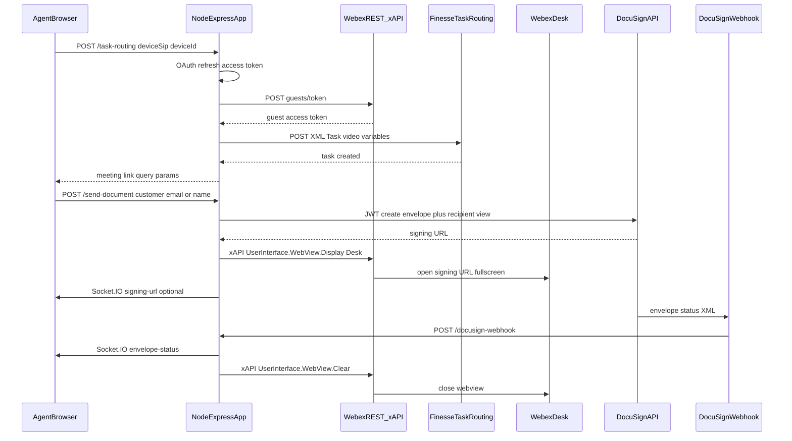

# Architecture diagram

Sequence overview: Finesse task creation, Webex guest token and meeting link,
DocuSign envelope and recipient view on the Desk via xAPI, webhook back to the
app, and Socket.IO updates to the agent UI.

