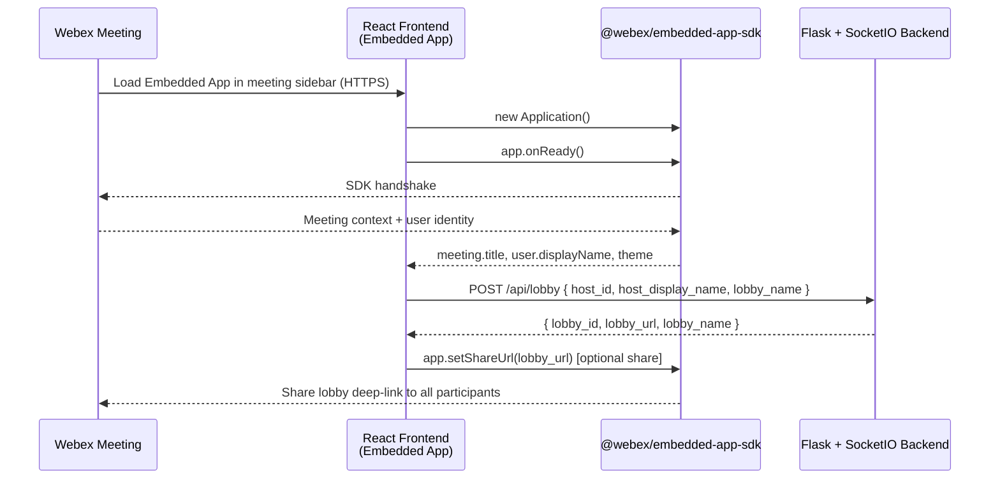
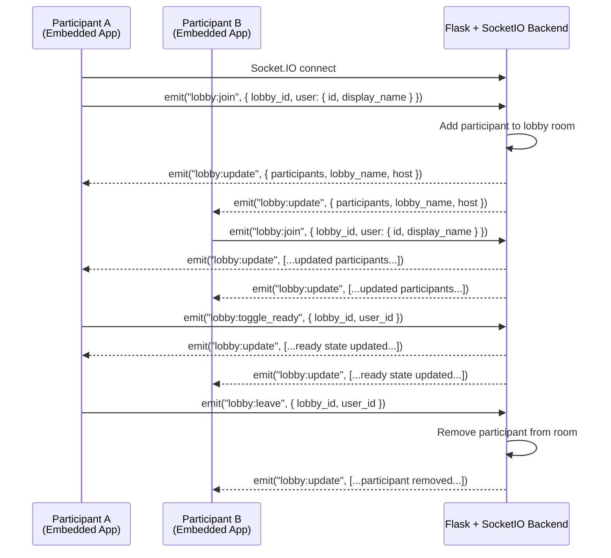
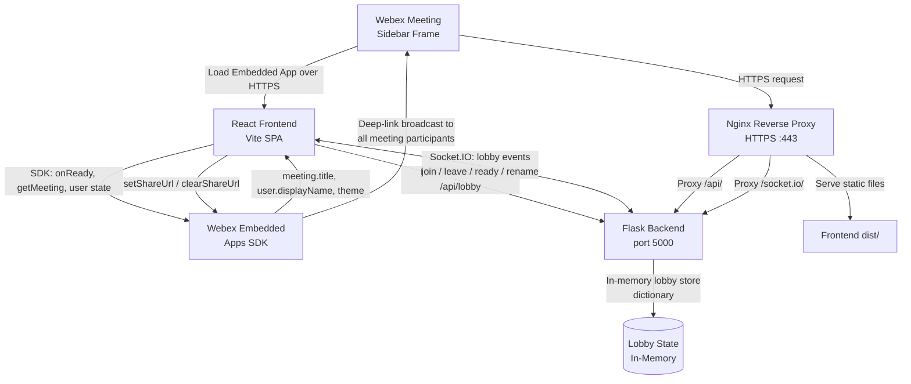

# Architecture Diagram — Multi-User Webex Embedded App Lobby

## Component Overview

The integration consists of three layers:

- **Webex Meeting** — Hosts the Embedded App in the meeting sidebar via the Embedded Apps framework
- **React Frontend (Vite)** — The Embedded App UI; initializes the Webex Embedded Apps SDK and manages real-time lobby state via Socket.IO
- **Flask + Flask-SocketIO Backend** — REST API for lobby lifecycle and WebSocket server for real-time participant events

## Sequence Diagram: Lobby Initialization

## Sequence Diagram: Participant Joins and Interacts

## Data Flow Summary

