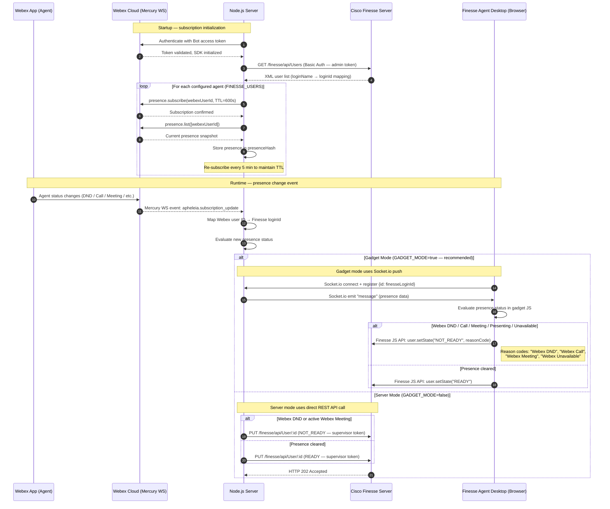

# Architecture Diagram — Webex Finesse Agent Presence Sync

This diagram shows the two operating modes of the integration: **Gadget mode** (recommended) and **Server mode**.

## Component Descriptions

| Component | Role |
|-----------|------|
| **Webex App (Agent)** | The agent's Webex desktop or mobile client. Presence changes here (DND, call, meeting) are the trigger. |
| **Webex Cloud (Mercury WS)** | Webex's real-time event infrastructure. The Node.js server subscribes to presence events via a persistent WebSocket connection using the internal `apheleia` event channel. |
| **Node.js Server** | The integration bridge. Subscribes to Webex presence, loads the Finesse user map, and either pushes via Socket.io (gadget mode) or calls the Finesse REST API (server mode). |
| **Cisco Finesse Server** | The contact center desktop platform. Exposes a REST API for reading and setting agent state. In gadget mode, also hosts the gadget framework used by the agent desktop. |
| **Finesse Agent Desktop (Browser)** | The agent's browser running the Finesse desktop. In gadget mode, loads the `WebexPresenceConnector` gadget, which connects to the Node.js server via Socket.io and calls the Finesse client-side JS API to set agent state directly. |

## Authentication Summary

| Credential | Used By | Purpose |
|-----------|---------|---------|
| `WEBEX_ACCESS_TOKEN` (Bot token) | Node.js Server → Webex Cloud | Authenticates SDK, subscribes to presence events |
| `FINESSE_ADMIN_TOKEN` (Basic Auth) | Node.js Server → Finesse REST API | Reads agent user list on startup; reads current agent state (server mode) |
| `FINESSE_SUPERVISOR_TOKEN` (Basic Auth) | Node.js Server → Finesse REST API | Sets agent state in server mode only |
| Finesse gadget session | Finesse Desktop → Finesse Server | The gadget runs in the agent's authenticated Finesse session; no extra credentials needed for gadget mode state changes |
