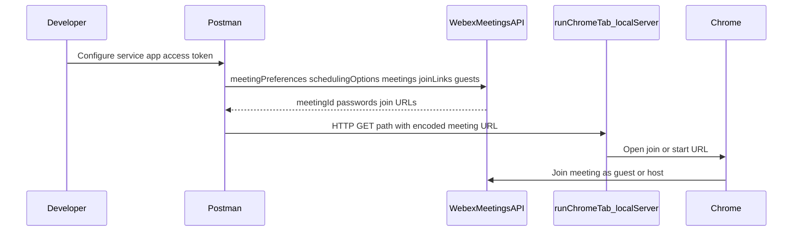

# Architecture

Sequence for validating guest-to-guest (G2G) meetings: Postman drives the Webex Meetings API; optional local helper opens join/start URLs in Chrome when Postman requests hit the helper.

For a token smoke test without Postman, the developer can run `node check-meeting-preferences.js` against `GET /v1/meetingPreferences` using the same bearer token.
