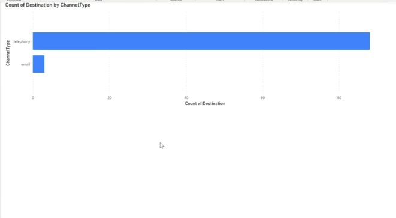

# Webex Contact Center GraphQL Search — Power BI Playbook

This Playbook is adapted from the [GraphQL Power BI sample](https://github.com/WebexSamples/webex-contact-center-api-samples/tree/main/reporting-samples/graphql-powerbi-sample) in the WebexSamples `webex-contact-center-api-samples` repository on GitHub.

The sample is a Spring Boot app that exposes the Webex Contact Center (WxCC) [GraphQL Search API](https://developer.webex.com/webex-contact-center/docs/api/v1/search) through HTTP endpoints so tools such as **Microsoft Power BI** (or other reporting clients) can consume task and agent reporting data. You can modify or extend the application for your own use cases.

> **Note:** This sample assumes basic familiarity with the GraphQL Search API and with Java / Spring Boot.

For a video walkthrough of the original sample, see [Integrating Webex Contact Center with Power BI — Sample Spring Boot Application](https://app.vidcast.io/share/6fd7cd09-7930-488c-9f02-0baa13f1d0e3).

## Use Case Overview

Reporting and operations teams often want WxCC task, queue, and agent metrics inside Microsoft Power BI or similar BI tools. WxCC exposes rich reporting through the documented GraphQL Search API. This sample runs a small Spring Boot app on your machine: you sign in with Webex once in a browser, then Power BI (or any HTTP client) calls the app to retrieve flattened JSON or CSV derived from `.graphql` query files shipped under `src/graphql/`. The same pattern can feed other external data stores or lakes.

**Target persona:** WxCC developers, report builders, or data engineers prototyping dashboards.

**Estimated implementation time:** About 2–4 hours (integration registration, environment setup, first successful query from Power BI or a browser).

## Architecture

The Spring Boot app serves `GET /` as the main entry. Unauthenticated users are redirected through Webex OAuth (`webexapis.com`). After the authorization code is exchanged for tokens, the app keeps the access and refresh tokens **in memory only** (lost on restart). Optional scheduled refresh extends the session. When a client requests data, `SearchGraphQLService` posts GraphQL payloads to `{DATA_CENTER_URL}/search?orgId=…`, where the org identifier is derived from the access token (not from a separate config property). `ExportUtil` maps nested JSON into rows suitable for tabular tools.

Power BI Desktop typically uses **Get Data → Web** (or a custom connector pattern) to call the same localhost URLs your browser uses after OAuth.

See the [architecture diagram](diagrams/architecture-diagram.md) for a sequence view.

## Prerequisites

- **Webex Contact Center:** Tenant where your user can authorize the integration and run Search queries appropriate to your role.
- **Webex integration:** Create an integration at [My Apps](https://developer.webex.com/my-apps) (or your admin workflow). Set the redirect URI to match this app (default `http://localhost:8080`). Scope used by default: `cjp:config_read` (override with `WXCC_OAUTH_SCOPE` if your org requires a different scope set).
- **WxCC API cluster:** Set `DATA_CENTER_URL` to the base URL for your region. Examples: `https://api.wxcc-us1.cisco.com`, `https://api.wxcc-anz1.cisco.com`, `https://api.wxcc-ca1.cisco.com`, `https://api.wxcc-eu1.cisco.com`, `https://api.wxcc-eu2.cisco.com`, `https://api.wxcc-jp1.cisco.com` (see `src/env.template`).
- **JDK 11+:** Verify with `java -version`.
- **Maven 3.x** (or use the included wrapper): Verify with `mvn -v`.
- **Microsoft Power BI Desktop** (optional but matches the primary use case) for web data import.
- **Network:** Outbound HTTPS to `webexapis.com` and your chosen `DATA_CENTER_URL`.

## Code Scaffold

Under `src/`:

- **`pom.xml`** — Spring Boot 2.5.x, Java 11, artifact `graphql-sample-java` (0.0.1-SNAPSHOT).
- **`src/main/java/.../Application.java`** — Spring Boot entry point.
- **`src/main/java/.../demo/controller/WebRestController.java`** — Routes for OAuth flow, GraphQL execution, and CSV/JSON export for connectors.
- **`src/main/java/.../demo/service/AuthService.java`** — OAuth authorize URL and token exchange/refresh against `webexapis.com`.
- **`src/main/java/.../demo/service/SearchGraphQLService.java`** — Posts GraphQL to WxCC Search with pagination helpers for task-style queries.
- **`src/main/java/.../demo/util/ExportUtil.java`** — JSON-to-table/CSV style export (may need extension for deeply nested result shapes).
- **`src/main/java/.../demo/util/ScheduledTasks.java`** — Token refresh scheduling.
- **`graphql/*.graphql`** — Example Search query files. In this build, the following are supported in sample flows: **`task`**, **`taskDetails`**, **`agentSession`**. The following are **not** supported out of the box (you can extend the code): `flowInteractions`, `flowTraceEvents`, `taskLegDetails`.
- **`src/main/resources/application.properties`** — Binds configuration from environment variables (no secrets in file).
- **`env.template`** — Variables to set before running; copy to `.env` and export them in your shell, or configure your IDE/run configuration.
- **`images/`** — Screenshot used above (`graphql-powerbi-sample.png`).

The code does **not** provide production-grade secret storage, HTTPS termination, multi-tenant isolation, or signed webhook verification. Treat it as a learning scaffold.

## Deployment Guide

1. **Clone** the Webex Playbooks repository and open `playbooks/graphql-powerbi-sample/`.
2. **Register a Webex integration** with redirect URI `http://localhost:8080` (or your chosen origin and port—must match `REDIRECT_URI`). Note the **Client ID** and **Client Secret**.
3. **Configure environment:** Copy `src/env.template` to `src/.env` (local only; do not commit). Set `CLIENT_ID`, `CLIENT_SECRET`, and optionally `REDIRECT_URI`, `DATA_CENTER_URL`, `WXCC_OAUTH_SCOPE`, and `OAUTH_STATE`. Spring Boot does not load `.env` automatically—**export** the variables in the terminal before starting the app (for example `set -a && source .env && set +a` on bash, or paste exports manually), or set them in your IDE run configuration.
4. **Build:** From `playbooks/graphql-powerbi-sample/src/`, run `mvn clean install` (or `./mvnw clean install` on Unix/macOS).
5. **Run:** Start the app with `java -jar target/graphql-sample-java-0.0.1-SNAPSHOT.jar` or `mvn spring-boot:run`. Confirm it listens on port **8080** (or the port you configured in Spring if changed).
6. **Complete OAuth:** In a browser, open `http://localhost:8080/`, sign in with Webex, and approve the integration. Stay logged in while you test Power BI or API calls.
7. **Pull data:** Use the query parameters and URL patterns the app exposes for a given `.graphql` file and response format (`JSON` or `CSV`). In Power BI Desktop, use **Get Data → Web** and point at the same localhost base URL (see the Vidcast link above for UI-oriented setup).
8. **Optional:** Review the [Search API documentation](https://developer.webex.com/webex-contact-center/docs/api/v1/search) and edit or add files under `src/graphql/` for your reporting needs; adjust `ExportUtil` if nested objects need flattening.

### Nested JSON and CSV

If responses contain nested objects, you may need to customize how JSON is converted to CSV—either multiple lines per parent row or a flattened single row. That is a modeling choice, not a limitation of Spring Boot or the Search API.

### Supplemental resources

- [Getting Started with GraphQL /search API](https://github.com/WebexSamples/webex-contact-center-api-samples/tree/main/graphql-sample) (related sample in the upstream monorepo)
- [GraphQL Search API — Tasks](https://developer.webex.com/webex-contact-center/docs/api/v1/search)
- [My Apps](https://developer.webex.com/my-apps)

## Known Limitations

- **In-memory tokens:** Restarting the JVM drops tokens; you must complete the browser OAuth flow again unless you add persistence.
- **Sample-only hardening:** No rate-limit handling, structured audit logging, or enterprise identity integration.
- **GraphQL coverage:** Only certain query families are exercised in this sample (see **Code Scaffold**). Extending to `flowInteractions`, `flowTraceEvents`, `taskLegDetails`, or other shapes requires Java changes.
- **Nested JSON:** Heavy nesting may require custom flattening for CSV or Power BI schemas.
- **Rate limits:** Subject to Webex and WxCC API limits.
- **Upstream sample intent:** These samples are for demos and learning how to call WxCC APIs—not production-ready designs. For production, plan architecture and security explicitly, including multi-org token handling if needed.
- **License:** This Playbook is provided under the Webex Playbooks repository license. See the repo [LICENSE](../../LICENSE). The upstream sample includes its own license terms in the monorepo—review before redistributing derived works.
- **Disclaimer:** This Playbook is provided as a starting point. Webex does not guarantee the functional accuracy of the source code. Test thoroughly before use in a production environment.

### Support and community

- [Webex Contact Center Developer Support](https://developer.webex.com/explore/support)
- [Webex Contact Center APIs Developer Community](https://community.cisco.com/t5/contact-center/bd-p/j-disc-dev-contact-center)
- [How to ask a question or start a discussion](https://community.cisco.com/t5/contact-center/webex-contact-center-apis-developer-community-and-support/m-p/4558270)
