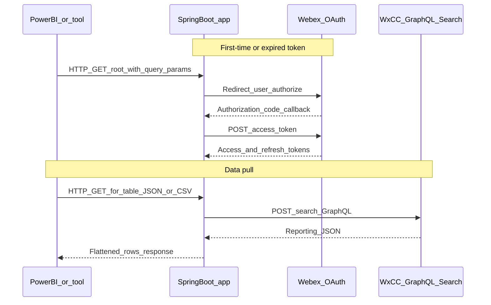

# Architecture — WxCC GraphQL to Power BI

This diagram shows how the sample connects Microsoft Power BI to the Webex Contact Center GraphQL Search API through a local Spring Boot app.

OAuth uses `webexapis.com`. GraphQL Search calls use the configured `DATA_CENTER_URL` (for example `https://api.wxcc-us1.cisco.com`).
