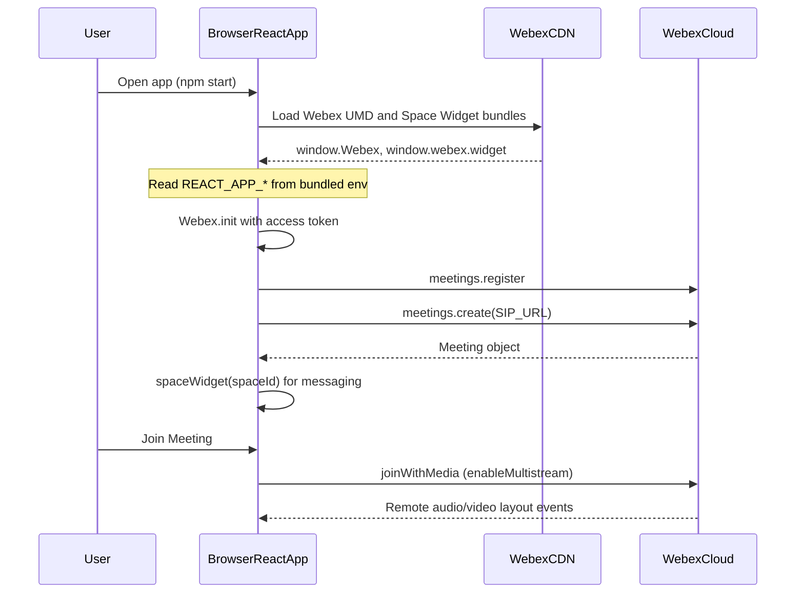

# Architecture

Browser React app loads the Webex JS SDK and Space Widget from CDN scripts, reads configuration from Create React App environment variables, initializes meetings with multistream, and embeds Teams messaging for the configured space.

For local development, all secrets are supplied via `.env.local` as `REACT_APP_*` variables; they are compiled into the client bundle (lab use only).
