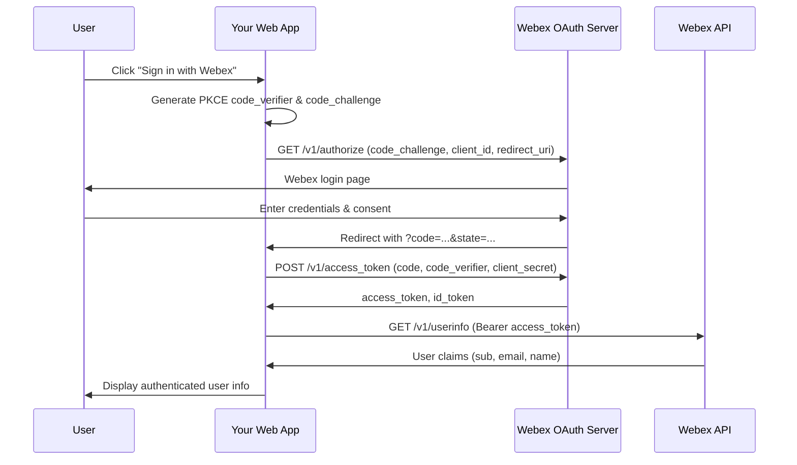

# Login with Webex — Architecture Diagram

```mermaid
sequenceDiagram
    participant User
    participant App as Your Web App
    participant WebexAuth as Webex OAuth Server
    participant WebexAPI as Webex API

    User->>App: Click "Sign in with Webex"
    App->>App: Generate PKCE code_verifier & code_challenge
    App->>WebexAuth: GET /v1/authorize (code_challenge, client_id, redirect_uri)
    WebexAuth->>User: Webex login page
    User->>WebexAuth: Enter credentials & consent
    WebexAuth->>App: Redirect with ?code=...&state=...
    App->>WebexAuth: POST /v1/access_token (code, code_verifier, client_secret)
    WebexAuth->>App: access_token, id_token
    App->>WebexAPI: GET /v1/userinfo (Bearer access_token)
    WebexAPI->>App: User claims (sub, email, name)
    App->>User: Display authenticated user info
```
