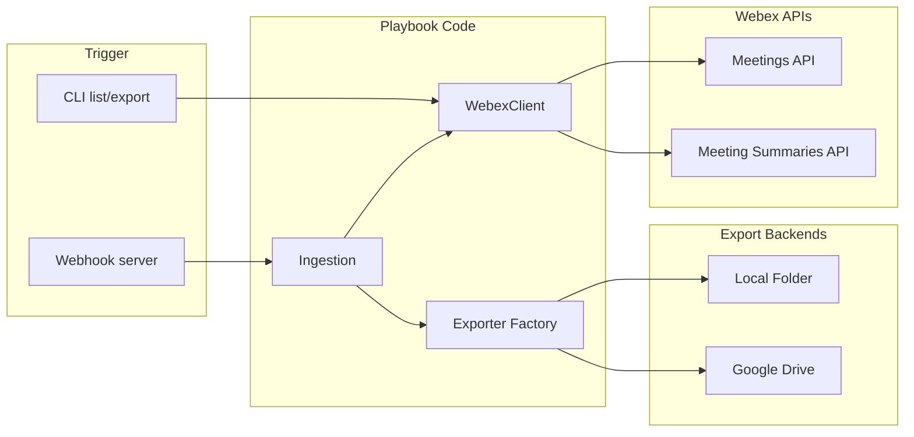

# Architecture Diagram — Meeting Data Exporter

This diagram shows the integration flow for exporting Webex meeting data to local storage or Google Drive.

## Flow Description

1. **Trigger:** A user runs the CLI (`list` or `export`) or the webhook server receives a meeting-ended notification from Webex.
2. **WebexClient:** Authenticates with a Bearer token and calls the Webex Meetings API (meetings, participants, recordings, transcripts) and Meeting Summaries API (AI summary and action items).
3. **Ingestion:** Collects all meeting data into a normalized `MeetingData` structure.
4. **Exporter Factory:** Selects the appropriate backend from `EXPORT_BACKEND` (local or google_drive).
5. **Backends:** Writes meeting data to a local directory or uploads to Google Drive.

## Authentication

- **Webex:** Personal Access Token or OAuth2. Set in `WEBEX_ACCESS_TOKEN`.
- **Google Drive:** OAuth2 (credentials.json + token.json). Required only when `EXPORT_BACKEND=google_drive`.
