# Architecture — UCM Config Analyzer and Webex Calling migration

This diagram shows how the offline **UCM Config Analyzer** fits into a **Webex Calling** migration planning workflow. No live Webex or UCM API calls are made during analysis.

```mermaid
flowchart LR
    subgraph ucmSide [UCM Administrator]
        Admin[UCM Admin]
    end

    subgraph export [Offline export]
        BAT[UCM BAT export job]
        TarFile[".tar archive CSV files"]
    end

    subgraph analyzer [Analyst workstation]
        MainPy[main.py]
        Proxy[ucmexport.Proxy]
        AppMod[app.App menu]
        Graph[user_dependency_graph]
        Digit[digit_analysis]
        Plotly[Plotly charts]
    end

    subgraph planning [Migration planning]
        Report[Console reports and visualizations]
        Plan[Webex Calling migration waves]
    end

    subgraph webex [Webex Calling target]
        WxC[Control Hub Webex Calling]
    end

    Admin --> BAT
    BAT --> TarFile
    TarFile --> MainPy
    MainPy --> Proxy
    Proxy --> AppMod
    AppMod --> Graph
    AppMod --> Digit
    AppMod --> Plotly
    Graph --> Plotly
    Digit --> Plotly
    Plotly --> Report
    Report --> Plan
    Plan --> WxC
```

**Authentication:** The analyzer needs no tokens. UCM authentication applies only when the admin runs the BAT export in CUCM. Webex Control Hub authentication applies later when executing the migration itself.
