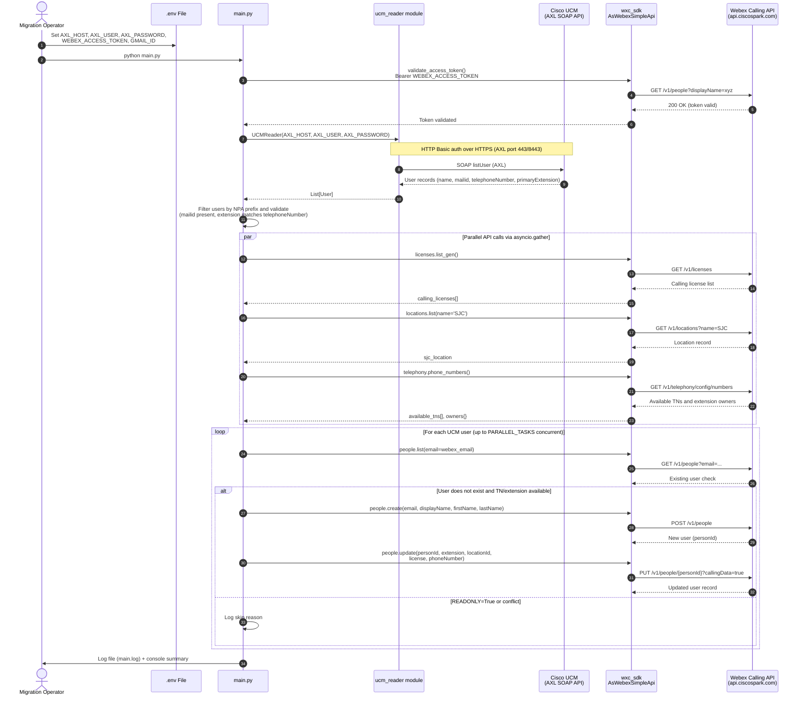

# Architecture Diagram — Cisco UCM to Webex Calling Migration

## Notes

- **Authentication:** UCM AXL uses HTTP Basic auth (`AXL_USER`/`AXL_PASSWORD`) over HTTPS. Webex Calling uses a Bearer token (`WEBEX_ACCESS_TOKEN`).
- **Parallel execution:** `asyncio.gather` runs up to `PARALLEL_TASKS` (default: 10) user provisioning coroutines concurrently to reduce wall-clock migration time.
- **READONLY guard:** When `READONLY = True` in `main.py`, the `people.create` and `people.update` calls are skipped. All validation and logging still runs, enabling a safe dry run.
- **Dial plan migration flow** (`read_gdpr.py`) follows the same UCM AXL pattern but writes directly to a CSV file rather than calling the Webex API.
