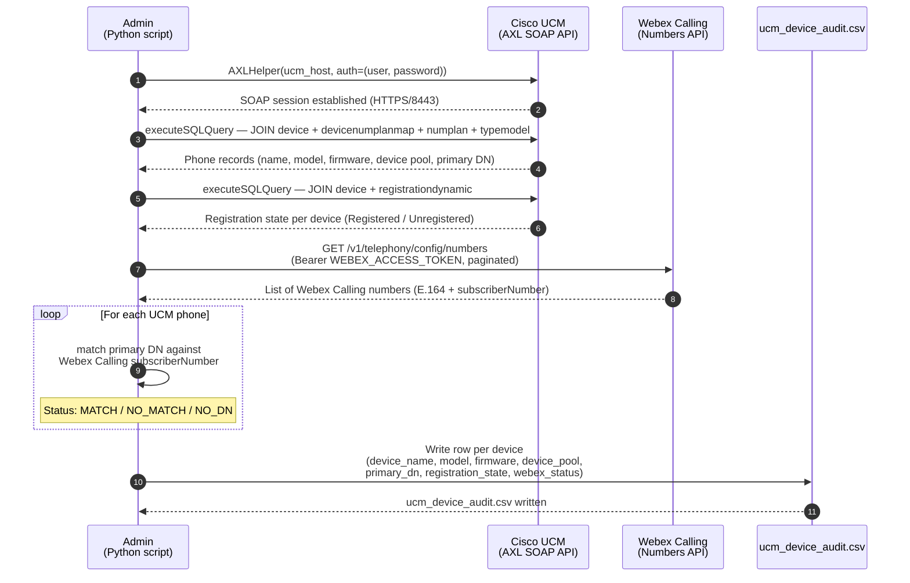
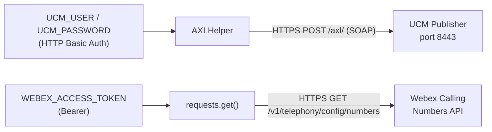

# Architecture Diagram — UCM AXL Inventory Export for Webex Calling Migration Planning

## Component Descriptions

| Component | Role |
|-----------|------|
| **Cisco UCM (AXL SOAP API)** | On-premises Unified Communications Manager. Exposes the Administrative XML (AXL) web service on port 8443. The `executeSQLQuery` method allows direct read access to the UCM Informix database. |
| **ucmaxl AXLHelper** | Python helper library that wraps `zeep` (SOAP client) to simplify AXL connections, version detection, and SQL batch pagination. |
| **Webex Calling Numbers API** | REST endpoint `GET /v1/telephony/config/numbers` that returns all phone numbers (DIDs and extensions) provisioned in the Webex Calling org, paginated at up to 1,000 per page. |
| **Admin (Python script)** | `main.py` — orchestrates the two-phase read (UCM inventory + Webex Calling numbers), performs DN matching, and writes the CSV report. |

## Authentication Flow

