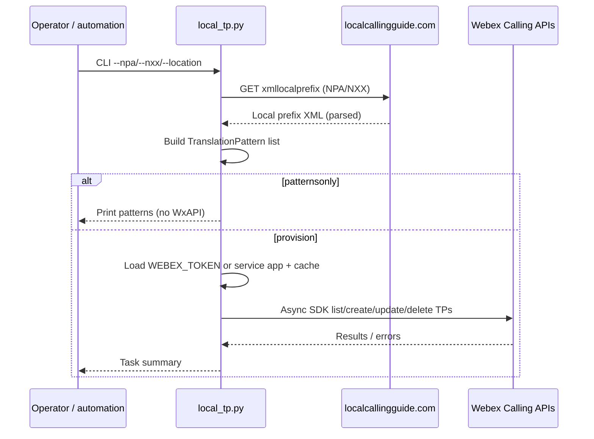

# Architecture — NANP translation patterns (webex-calling-nanp)

```mermaid
sequenceDiagram
  participant Op as Operator / automation
  participant Script as local_tp.py
  participant LCG as localcallingguide.com
  participant WxAPI as Webex Calling APIs

  Op->>Script: CLI --npa/--nxx/--location
  Script->>LCG: GET xmllocalprefix (NPA/NXX)
  LCG-->>Script: Local prefix XML (parsed)
  Script->>Script: Build TranslationPattern list
  alt patternsonly
    Script-->>Op: Print patterns (no WxAPI)
  else provision
    Script->>Script: Load WEBEX_TOKEN or service app + cache
    Script->>WxAPI: Async SDK list/create/update/delete TPs
    WxAPI-->>Script: Results / errors
    Script-->>Op: Task summary
  end
```
