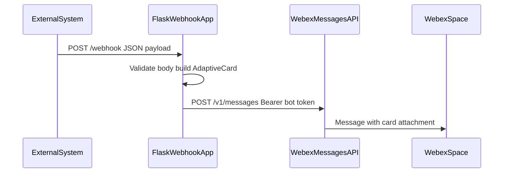

# Architecture — Incoming Webhook to Webex Messaging Adaptive Card

External systems can signal events with HTTP POSTs. This sample turns a structured JSON payload into a **Webex message** that includes an **Adaptive Card** attachment.

Authentication: the **Webex bot token** is stored server-side (environment only). Callers of `/webhook` are **not** authenticated in this sample.
