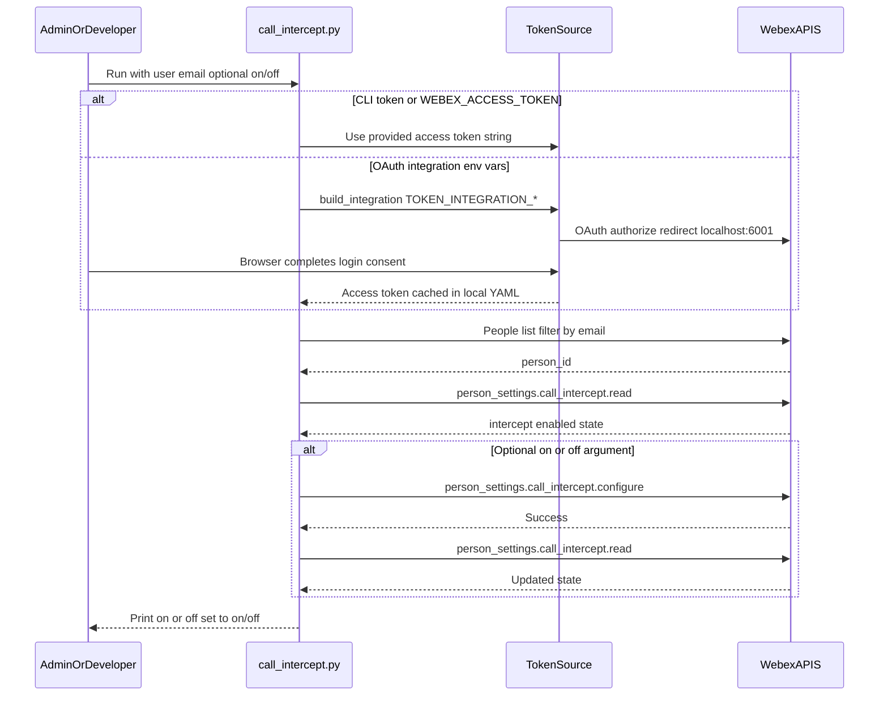

# Architecture — Webex Calling call intercept CLI

This diagram shows how the sample CLI authenticates, resolves a user, and reads or updates **call intercept** via **Webex** APIs.

Note: Sequence labels use simplified endpoint names; the **wxc_sdk** maps these to documented REST resources.
