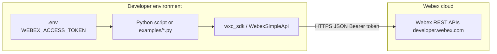

# Architecture — wxc_sdk + Webex APIs

Python automation using the **wxc_sdk** client library calls **documented Webex HTTPS REST APIs** with a **Bearer access token**. Tokens are issued outside this diagram (OAuth integration, bot, or admin workflow per your org).

**Notes**

- **No** Webex-hosted app server is required for the SDK itself; runs on your workstation, CI, or your servers.
- **Scopes** and **Control Hub** roles determine which endpoints succeed; handle **401/403** per [Webex API basics](https://developer.webex.com/docs/api/basics).
