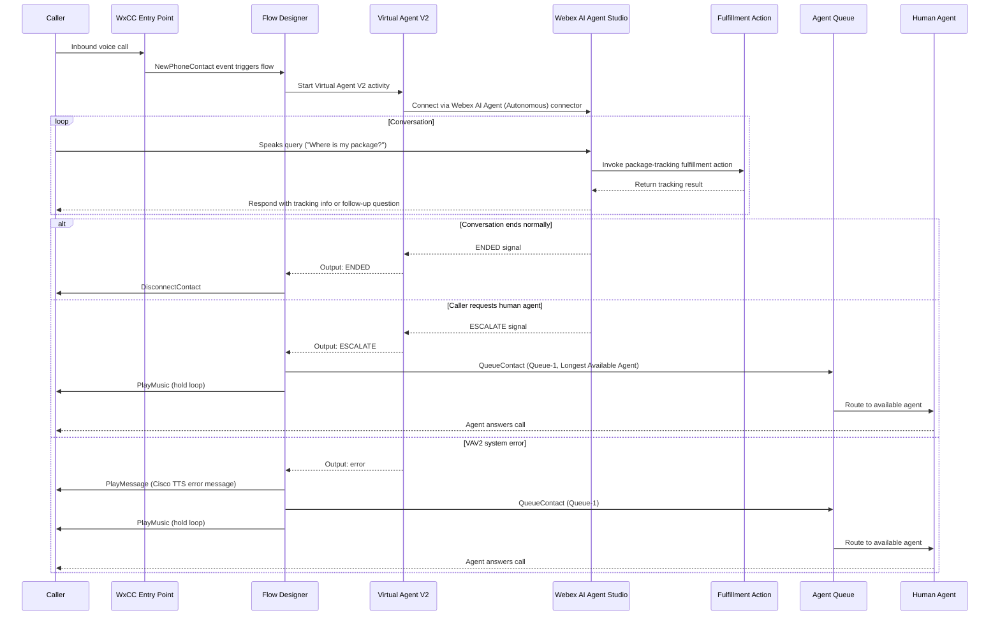

# Architecture Diagram — WxCC AI Agent Autonomous Package Tracking

This diagram shows the end-to-end call flow from the moment a customer dials in through resolution or human escalation.

## Component Summary

| Component | Role |
|---|---|
| WxCC Entry Point | Receives the inbound PSTN call and routes to the flow |
| Flow Designer | Orchestrates the call using the `ai_agent_autonomous` flow |
| Virtual Agent V2 | WxCC activity that bridges the voice call to AI Agent Studio |
| Webex AI Agent Studio | Hosts the autonomous AI agent with actions and knowledge base |
| Fulfillment Action | Executes package lookup logic (via Webex Connect or webhook) |
| Agent Queue (`Queue-1`) | Holds the call when a human agent is needed |
| Human Agent | Handles escalated or error-path calls |

## Key Flow Decision Points

- **ENDED** — the AI agent determines the caller's need has been met and signals end of conversation; the flow disconnects the call.
- **ESCALATE** — the caller explicitly requests a human (or the AI agent determines it cannot resolve the query); the flow routes to the queue.
- **error** — a system-level fault in the Virtual Agent V2 activity; the flow plays a TTS apology message and routes to the queue as a fallback.
