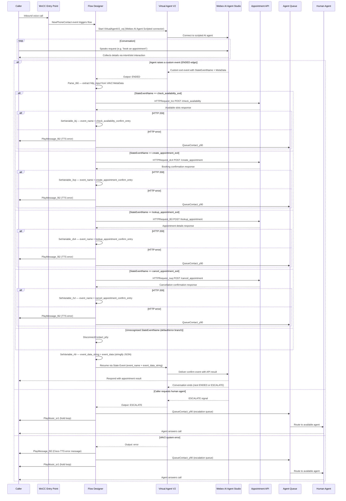

# Architecture Diagram — WxCC AI Agent Scripted Doctor's Appointment Booking

This diagram shows the end-to-end call flow from the moment a customer dials in through multi-event fulfillment, or human escalation.

## Component Summary

| Component | Role |
|---|---|
| WxCC Entry Point | Receives the inbound PSTN call and routes to the flow |
| Flow Designer | Orchestrates multi-event fulfillment, State Event exchange, and queue routing |
| Virtual Agent V2 | WxCC activity bridging the voice call to AI Agent Studio (Scripted connector) |
| Webex AI Agent Studio | Hosts the scripted AI agent with appointment intents and slots |
| Appointment API | Demo HTTP API with four endpoints: check availability, create, lookup, and cancel |
| Parse Activity (`Parse_t66`) | Extracts `http_input` from VAV2 MetaData after the ENDED edge fires |
| Case Activity (`Case_9ia`) | Routes flow execution to the correct HTTP request based on `StateEventName` |
| Agent Queue | Holds callers waiting for a human agent on escalation or error paths |
| Human Agent | Handles escalated or error-path calls |

## Key Flow Decision Points

- **ENDED + StateEventName** — the scripted AI agent raises one of four custom exit events; `Case_9ia` selects the matching HTTP endpoint. The flow returns the API result via a confirm State Event, resuming the conversation.
- **ESCALATE** — the caller explicitly requests a human; the flow routes directly to the escalation queue.
- **error** — a system-level fault in the Virtual Agent V2 activity; the flow plays a TTS apology and routes to the escalation queue as a fallback.
- **HTTP non-200** — each Condition activity's `false` branch routes to `PlayMessage_l92` then the escalation queue, ensuring the caller is always handled even when the appointment API is unavailable.
- **Case default/error** — an unrecognised `StateEventName` or Case error routes directly to `DisconnectContact_p0y`.
