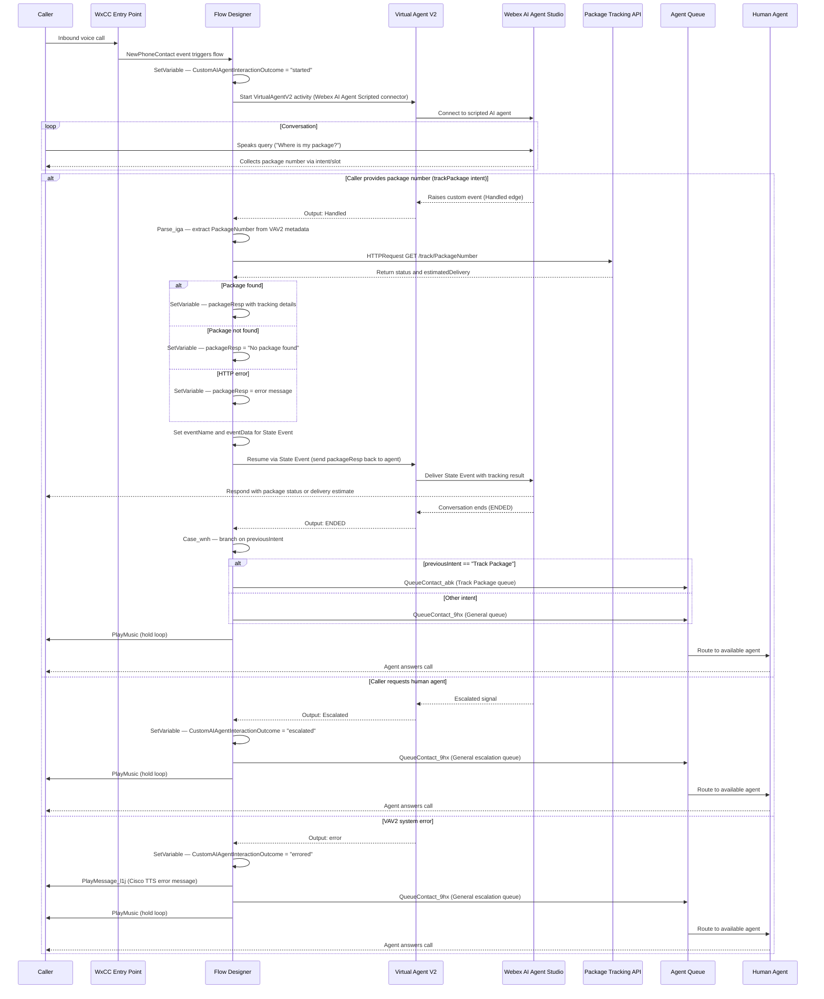

# Architecture Diagram — WxCC AI Agent Scripted Package Tracking

This diagram shows the end-to-end call flow from the moment a customer dials in through fulfillment, intent-based routing, or human escalation.

## Component Summary

| Component | Role |
|---|---|
| WxCC Entry Point | Receives the inbound PSTN call and routes to the flow |
| Flow Designer | Orchestrates fulfillment, State Event exchange, and intent routing |
| Virtual Agent V2 | WxCC activity bridging the voice call to AI Agent Studio (Scripted connector) |
| Webex AI Agent Studio | Hosts the scripted AI agent with intents and slots |
| Package Tracking API | Demo HTTP API returning package status and estimated delivery |
| Case Activity (`Case_wnh`) | Routes callers to different queues based on `previousIntent` |
| Agent Queue (Track Package) | Holds callers whose last intent was package tracking |
| Agent Queue (General) | Holds callers on escalation or other intents |
| Human Agent | Handles escalated or error-path calls |

## Key Flow Decision Points

- **Handled** — the scripted AI agent raises a custom event (caller has provided a package number); the flow extracts the number, calls the tracking API, and returns the result via State Event.
- **Escalated** — the caller explicitly requests a human; the flow routes directly to the general escalation queue.
- **error** — a system-level fault in the Virtual Agent V2 activity; the flow plays a TTS apology and routes to the general queue as a fallback.
- **Case branch** — after the agent concludes, the `previousIntent` variable determines which queue the caller is routed to, enabling separate handling for different inquiry types.
- **CustomAIAgentInteractionOutcome** — set at each state transition; used to build custom interaction outcome reports in Webex Analyzer.
