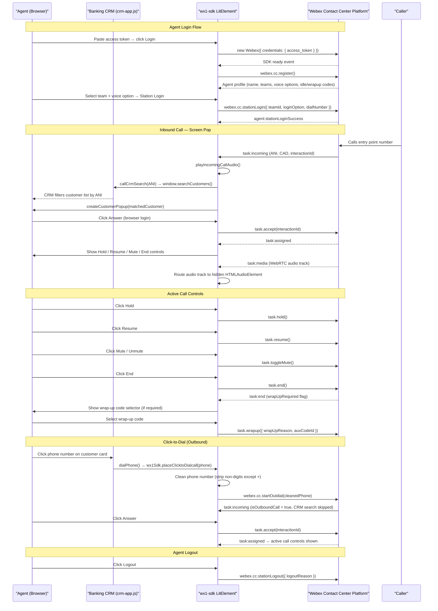

# Architecture Diagram — Webex Contact Center Agent Desktop Banking CRM

```mermaid
sequenceDiagram
    participant Agent as "Agent (Browser)"
    participant CRM as "Banking CRM (crm-app.js)"
    participant SDK as "wx1-sdk LitElement"
    participant WxCC as "Webex Contact Center Platform"
    participant Caller as "Caller"

    Note over Agent,WxCC: Agent Login Flow
    Agent->>SDK: Paste access token → click Login
    SDK->>WxCC: new Webex({ credentials: { access_token } })
    WxCC-->>SDK: SDK ready event
    SDK->>WxCC: webex.cc.register()
    WxCC-->>SDK: Agent profile (name, teams, voice options, idle/wrapup codes)
    Agent->>SDK: Select team + voice option → Station Login
    SDK->>WxCC: webex.cc.stationLogin({ teamId, loginOption, dialNumber })
    WxCC-->>SDK: agent:stationLoginSuccess

    Note over Agent,WxCC: Inbound Call — Screen Pop
    Caller->>WxCC: Calls entry point number
    WxCC->>SDK: task:incoming (ANI, CAD, interactionId)
    SDK->>SDK: playIncomingCallAudio()
    SDK->>CRM: callCrmSearch(ANI) → window.searchCustomers()
    CRM-->>Agent: CRM filters customer list by ANI
    SDK->>Agent: createCustomerPopup(matchedCustomer)
    Agent->>SDK: Click Answer (browser login)
    SDK->>WxCC: task.accept(interactionId)
    WxCC-->>SDK: task:assigned
    SDK->>Agent: Show Hold / Resume / Mute / End controls
    WxCC-->>SDK: task:media (WebRTC audio track)
    SDK->>SDK: Route audio track to hidden HTMLAudioElement

    Note over Agent,WxCC: Active Call Controls
    Agent->>SDK: Click Hold
    SDK->>WxCC: task.hold()
    Agent->>SDK: Click Resume
    SDK->>WxCC: task.resume()
    Agent->>SDK: Click Mute / Unmute
    SDK->>WxCC: task.toggleMute()
    Agent->>SDK: Click End
    SDK->>WxCC: task.end()
    WxCC-->>SDK: task:end (wrapUpRequired flag)
    SDK->>Agent: Show wrap-up code selector (if required)
    Agent->>SDK: Select wrap-up code
    SDK->>WxCC: task.wrapup({ wrapUpReason, auxCodeId })

    Note over Agent,WxCC: Click-to-Dial (Outbound)
    Agent->>CRM: Click phone number on customer card
    CRM->>SDK: dialPhone() → wx1Sdk.placeClicktoDialcall(phone)
    SDK->>SDK: Clean phone number (strip non-digits except +)
    SDK->>WxCC: webex.cc.startOutdial(cleanedPhone)
    WxCC->>SDK: task:incoming (isOutboundCall = true, CRM search skipped)
    Agent->>SDK: Click Answer
    SDK->>WxCC: task.accept(interactionId)
    WxCC-->>SDK: task:assigned → active call controls shown

    Note over Agent,WxCC: Agent Logout
    Agent->>SDK: Click Logout
    SDK->>WxCC: webex.cc.stationLogout({ logoutReason })
```
