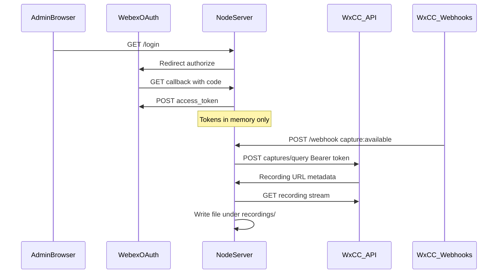

# WxCC — Call recording download

- **Trigger:** WxCC sends a `capture:available` webhook when a recording is ready.
- **Authentication:** An operator completes OAuth in a browser once so the Node process holds an access token for [Captures API](https://developer.webex.com/webex-contact-center/docs/api/v1/captures) query calls.
- **Download:** The app calls `POST /v1/captures/query` on the WxCC API base for your cluster, then streams the file from the returned storage URL to the local `recordings` directory.
