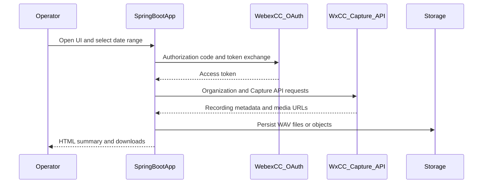

# Webex Contact Center call recording export

This diagram summarizes how the Spring Boot sample authenticates with Webex Contact Center, calls the Capture API for call recording metadata and URLs, and writes audio to a configured storage backend.

