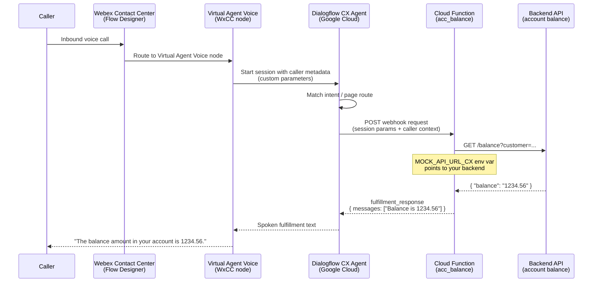
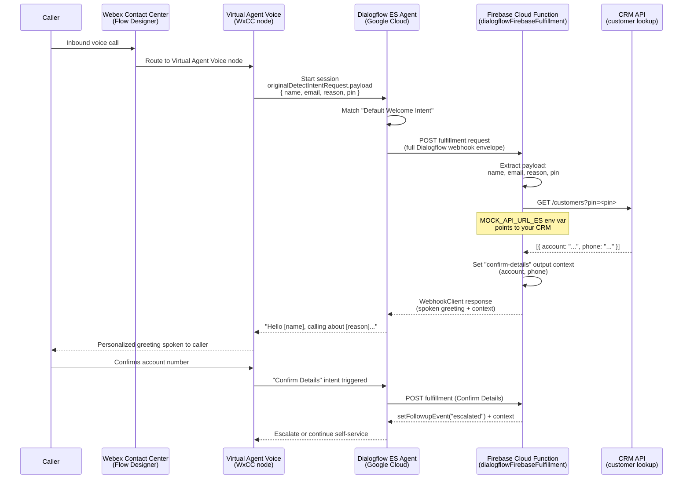

# Architecture Diagrams — Webex Contact Center + Google Dialogflow

Two separate data-flow diagrams are shown below — one for each Dialogflow generation.
The core WxCC → Dialogflow handoff is the same in both; the differences are in where
the fulfillment webhook runs and how caller context is structured.

---

## Dialogflow CX — Cloud Function Webhook

The CX sample uses Dialogflow CX's native webhook page/route integration. WxCC passes
caller parameters to CX directly, and the CX agent invokes a standalone Google Cloud
Function to fetch account data.

**Key points:**
- Authentication: Google Cloud IAM on the Cloud Function; no Webex credentials in the function
- Caller context: passed as Dialogflow CX session parameters from the WxCC Virtual Agent Voice node
- Response shape: `{ fulfillment_response: { messages: [{ text: { text: [...] } }] } }`

---

## Dialogflow ES — Firebase Cloud Function (Inline Editor)

The ES sample uses Dialogflow ES's built-in Fulfillment Inline Editor, which deploys to
Firebase Cloud Functions. WxCC passes caller context in the `originalDetectIntentRequest.payload`
field of the standard Dialogflow webhook envelope.

**Key points:**
- Authentication: Firebase/Google Cloud service account linked to the Dialogflow ES agent
- Caller context: read from `request.body.originalDetectIntentRequest.payload` — this is the standard WxCC-to-Dialogflow ES data channel
- Response mechanism: `dialogflow-fulfillment` SDK (`WebhookClient`) — `agent.add()` for spoken text, `agent.context.set()` for multi-turn state, `agent.setFollowupEvent()` for intent chaining
- Multi-turn: the ES sample demonstrates a two-turn flow (Welcome → Confirm Details) using Dialogflow output contexts

---

## Side-by-side summary

| | CX Sample | ES Sample |
|---|---|---|
| **Webhook host** | Google Cloud Functions (standalone) | Firebase Cloud Functions (Inline Editor) |
| **Caller context channel** | CX session parameters | `originalDetectIntentRequest.payload` |
| **Response format** | Raw `fulfillment_response` JSON | `dialogflow-fulfillment` SDK |
| **Multi-turn support** | Via CX pages and route groups | Via Dialogflow ES output contexts |
| **Deploy method** | `gcloud functions deploy` or Cloud Console | Dialogflow ES Fulfillment → Deploy button |
