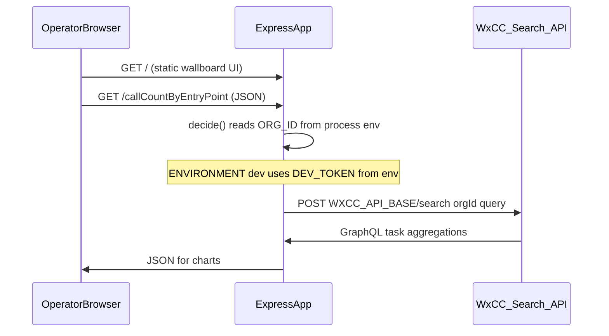

# WxCC GraphQL wallboard

- **UI:** Express serves static assets from `src/views` and JSON under routes such as `/callCountByEntryPoint`.
- **Token path (dev):** With `ENVIRONMENT=dev`, tokens come from `DEV_TOKEN` in the environment (see `controller/secured/tokenFromDev.js`). Optional MongoDB routes exist for an alternate upstream flow.
- **Search API:** Wallboard controllers call the documented GraphQL Search endpoint at `{WXCC_API_BASE}/search?orgId=...` with `Authorization: Bearer <token>`.
