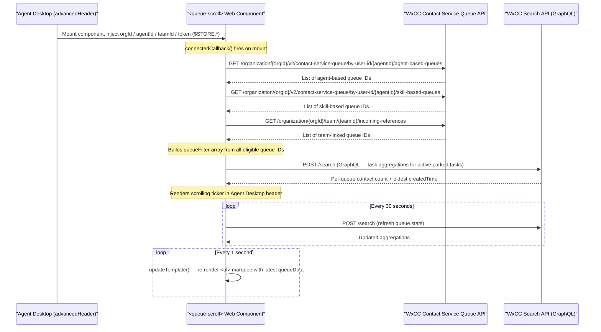

# Architecture Diagram — WxCC Queue Scroll Widget

This diagram shows how the `<queue-scroll>` web component integrates with the Webex Contact Center Agent Desktop and the WxCC platform APIs.

## Component Flow Notes

- **Authentication:** The Agent Desktop injects the agent's live access token via `$STORE.auth.accessToken`. No OAuth flow is required inside the widget itself — token lifecycle is managed entirely by the Agent Desktop.
- **Queue discovery:** Three parallel REST calls build the list of queues the agent is eligible for. This runs once on mount and the resulting `queueFilter` is reused for all subsequent `getStats()` calls.
- **Stats polling:** The Search API GraphQL query filters for tasks with `isActive: true` and `status: parked`, then aggregates `count(id)` (contacts in queue) and `min(createdTime)` (oldest wait) grouped by `lastQueue`.
- **Rendering:** The marquee animation is CSS-driven (`@keyframes scroll`). The list of `<li>` items is duplicated in the DOM to create a seamless loop. Animation duration scales with the number of queues (`queueStats.length * 10` seconds).
- **Standalone test mode:** For local testing outside the Agent Desktop, the four attributes are set directly on the `<queue-scroll>` tag in `index.html`.
