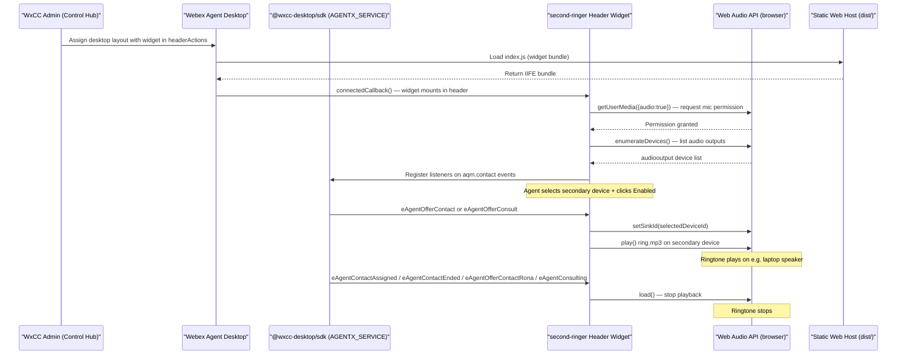

# Architecture Diagram — Second Ringer Header Widget for Webex Contact Center

The Second Ringer is a client-side **Header Widget** embedded in the Webex Contact Center Agent Desktop. There is no backend server — all logic runs in the agent's browser using the `@wxcc-desktop/sdk` and the browser's Web Audio API.



## Component Notes

| Component | Role |
|-----------|------|
| **WxCC Admin (Control Hub)** | Creates the Agent Desktop layout JSON with the widget registered in `headerActions`; assigns the layout to an agent team |
| **Webex Agent Desktop** | Loads and renders the widget in the persistent header bar at agent login |
| **Static Web Host** | Serves `dist/index.js` and `dist/ring.mp3` over HTTPS; no server-side logic required |
| **@wxcc-desktop/sdk** | Provides `window.AGENTX_SERVICE.aqm.contact` event bus; widget subscribes to contact lifecycle events |
| **second-ringer Header Widget** | Lit web component (`<second-ringer>`); handles device selection UI, event subscriptions, and ringer control |
| **Web Audio API** | Browser-native API used to enumerate audio output devices (`enumerateDevices`) and route audio to a selected device (`setSinkId`) |

## Header Widget Placement

The `<second-ringer>` element is declared in the `headerActions` array of the desktop layout JSON. This placement makes it persistently visible in the Agent Desktop top navigation bar — the correct pattern for always-on utility controls in WxCC.

```json
"headerActions": [
  {
    "id": "second-ringer",
    "type": "widget",
    "attributes": {
      "src": "https://your-host.example.com/second-ringer/index.js"
    }
  }
]
```
