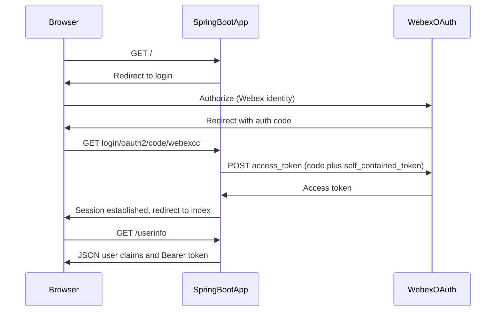

# Architecture — WxCC Java OAuth token sample

OAuth2 authorization code flow for a browser user against Webex APIs, with the access token exposed for API experimentation.

For narrative context, see the **Architecture** section in [README.md](../README.md).
