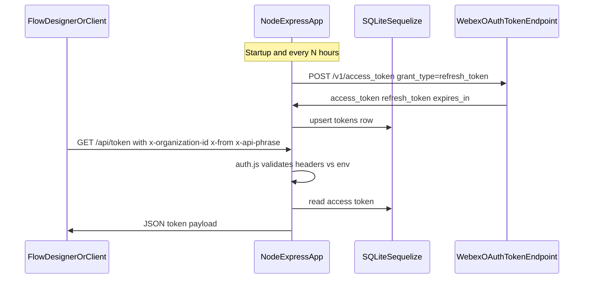

# WxCC token management sample

- **Refresh path:** `scheduler/scheduler.js` calls `https://webexapis.com/v1/access_token` using `CLIENT_ID`, `CLIENT_SECRET`, and `REFRESH_TOKEN` from the environment, then persists the result via `service/tokenService.js`.
- **Read path:** `server.js` exposes `GET /api/token` only when `auth.js` accepts the caller (org ID, `FROM`, `PASSPHRASE` as `x-api-phrase`, `SOURCE_IP`, and JSON content types).
- **Storage:** Default SQLite file at `src/db/db.sqlite` (see `db/db.js` and `env.template`).
