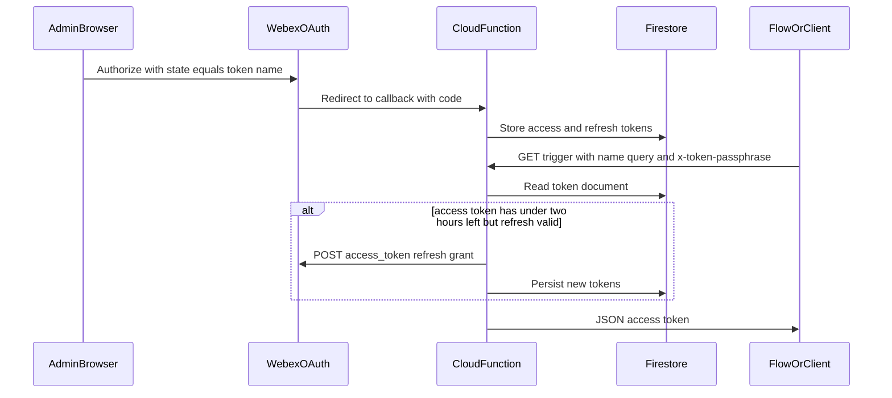

# Architecture — WxCC token service (Firebase)

HTTP trigger on **Google Cloud Functions** runs `tokenService` ([`src/index.js`](../src/index.js)). **Firebase Admin** reads and writes OAuth state in **Cloud Firestore** (`tokens` collection). Callers use **Webex** OAuth and `https://webexapis.com/v1/access_token` for code exchange and refresh.

For a self-hosted Express + SQLite alternative, see [wxcc-token-management-sample](../../wxcc-token-management-sample/README.md).
