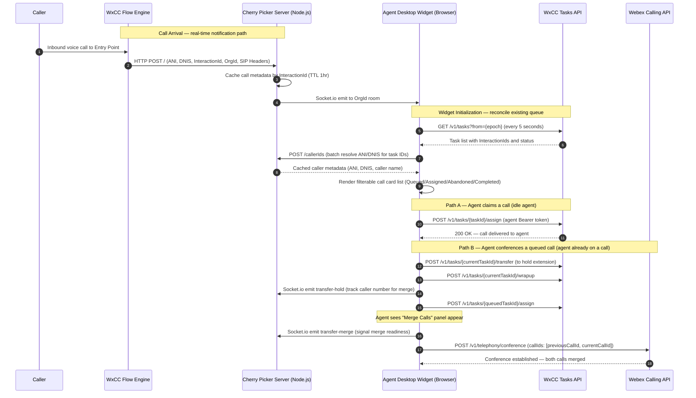

# Architecture Diagram — WxCC Voice Cherry Picker

This diagram shows the two main interaction paths: **call arrival** (real-time notification from the WxCC Flow) and **call claim / conference** (agent-initiated via the widget).

## Component Descriptions

| Component | Role |
|-----------|------|
| **Caller** | The inbound caller arriving at the WxCC Entry Point. |
| **WxCC Flow Engine** | Executes the Flow Builder flow. An HTTP Request node fires a webhook on `NewPhoneContact` to notify the Cherry Picker server before routing to the queue. |
| **Cherry Picker Server** | A Node.js Express + Socket.io server that receives flow webhooks, caches caller metadata in a TTL in-memory store, and pushes updates to connected widget clients. Also exposes `/callerIds` for bulk ANI/DNIS lookup and `/transfer-hold` for the conference hold-polling flow. |
| **Agent Desktop Widget** | A custom Web Component (`sa-ds-voice-sdk`) loaded in the Agent Desktop navigation panel. Uses `@wxcc-desktop/sdk` for agent identity and access token. Connects to the server via Socket.io and to the WxCC Tasks API directly using the agent's Bearer token. |
| **WxCC Tasks API** | The documented WxCC REST API (`/v1/tasks`) used to list queued calls and to assign or transfer tasks. All calls are authenticated with the agent's OAuth access token from `@wxcc-desktop/sdk`. |
| **Webex Calling API** | Used in the conference path to merge two active calls via `POST /v1/telephony/conference`. Authenticated with the agent's Webex Calling access token from `Desktop.agentContact.SERVICE.webexCalling`. |

## Authentication Summary

| Credential | Used By | Purpose |
|-----------|---------|---------|
| Agent OAuth access token (from `@wxcc-desktop/sdk`) | Widget → WxCC Tasks API | `GET /v1/tasks`, `POST /v1/tasks/{id}/assign`, `/transfer`, `/wrapup` |
| Agent Webex Calling token (from `Desktop.agentContact.SERVICE.webexCalling`) | Widget → Webex Calling API | `POST /v1/telephony/conference` — merge two call legs |
| No server-side auth | Cherry Picker Server | The server does not authenticate incoming flow webhooks. For production, add a shared secret or token validation on `POST /` |

## Data Flow Notes

- **Socket.io rooms** are scoped to `OrgId` so agents only receive calls from their own WxCC org when the server is shared.
- **Dual notification paths**: calls appear immediately via Socket.io when the Flow is configured, and are also discovered on the 5-second polling interval as a fallback. The widget deduplicates by `InteractionId`.
- **Conference flow** relies on the Webex Mercury WebSocket (`event:telephony_calls.received`) to detect when the transferred call rings back, enabling automatic call ID resolution for the conference request.
